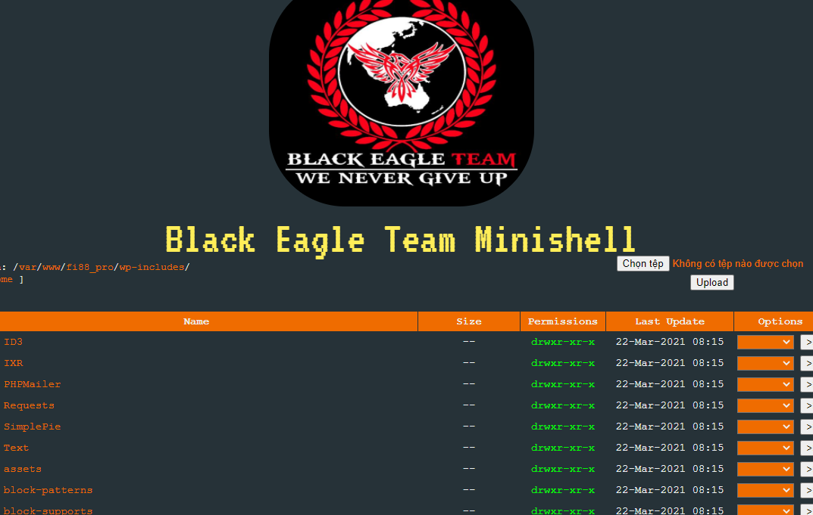

# nhat-ky-tim-hacker
nhat ky tim hacker

hacker sửa file index.php
#có 2 cách => 
+ cách 1 vào phpmyadmin => sửa nội dung bài viết
+ cách 2 sửa trực tiếp ndung file index.php

+ Cách 1 thì khó attach vì mọi thứ là của phpmyadmin dựng sẵn lên
+ Cách 2, nó scan hoặc bằng cách nào đó, nó có được user và pass của con wp-admin, từ đó nó dùng file manager plugin , upload file shell lên (wp-includes/min.php)

### Đưa ra kết luận đó vì:
#### 1.Dựa vào last change của file index.php => quét log trong thời gian đó
log access của apache tại 
/var/log/apache2 (Sau sẽ làm web hỗ trợ tìm kiếm log) (hoặc sẽ dùng python, auto gen ra 1 file excel, trên đó có các tool tìm kiếm, filter các kiểu)
Dựa vào khung thời gian last change index => thấy được có file min.php được truy cập lúc đó => file min chính là file tạo ra file index

#### 2. Lại mở xem file min được tạo ra lúc nào => quét ra thì nó dùng file manager plugin

#### 3. Quét ra thấy ô con login wp-admin

#### 4. Shell của ông con để lại

#### 5. Trang tra location cuả ô hacker (ISP là nhà cung cấp dịch vụ mạng)
https://www.ip2location.com/demo/103.139.102.90

#### 6. Trang check ip của mình
https://api.myip.com/